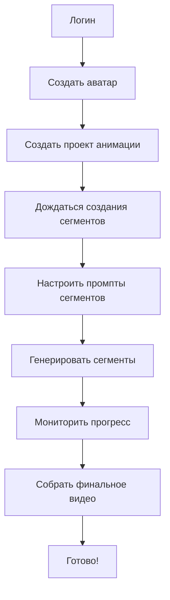

# 📖 ToonzyAI Backend Documentation Index

## 🎯 Полная документация бэкенда для фронтенд разработчиков

### 📋 Файлы документации:

## 1. 📚 [BACKEND_API_DOCUMENTATION.md](./BACKEND_API_DOCUMENTATION.md) - **ГЛАВНАЯ ДОКУМЕНТАЦИЯ**
> **🔥 Полная документация API (1495 строк)**
- ✅ Архитектура системы и технологии
- ✅ Детальное описание всех endpoints
- ✅ Аутентификация и авторизация
- ✅ Схемы данных и модели
- ✅ Обработка ошибок
- ✅ Workflow примеры
- ✅ Настройка и развертывание

## 2. ⚡ [API_QUICK_REFERENCE.md](./API_QUICK_REFERENCE.md) - **БЫСТРЫЙ СПРАВОЧНИК**
> **🚀 Краткий справочник для быстрого доступа (155 строк)**
- ✅ Основные endpoints
- ✅ Примеры запросов
- ✅ Статусы и ошибки
- ✅ Polling примеры

## 3. 🚀 [PARALLEL_GENERATION_GUIDE.md](./PARALLEL_GENERATION_GUIDE.md) - **ПАРАЛЛЕЛЬНАЯ ГЕНЕРАЦИЯ ВИДЕО**
> **⚡ Новая система параллельной генерации всех сегментов сразу!**
- ✅ **5x быстрее** - все сегменты генерируются одновременно
- ✅ **Batch operations** - установка промптов для всех сегментов сразу
- ✅ **React компоненты** - готовые хуки и компоненты для фронтенда
- ✅ **Независимая генерация** - каждый сегмент использует исходный аватар
- ✅ **Полный контроль** - пользователь задает промпт для каждого сегмента
- ✅ **API Cleanup** - удалены deprecated endpoints (signed URLs, старые схемы)

## 4. 🎨 [FRONTEND_API_GUIDE_V2.md](./FRONTEND_API_GUIDE_V2.md) - **НОВОЕ API-РУКОВОДСТВО ФРОНТА (V2)**
> **🆕 Кратко и только актуальные эндпойнты (169 строк)**
- Обязательный prompt на сегмент
- Упрощённые маршруты (без signed URL)
- Примеры React-хуков (useProgress)
- Quick-start и ошибки

### (Legacy)
* [FRONTEND_INTEGRATION_GUIDE.md](./FRONTEND_INTEGRATION_GUIDE.md) – полный туториал (может содержать устаревшие роуты)

## 4. 🚀 [REACT_COMPONENTS_EXAMPLES.md](./REACT_COMPONENTS_EXAMPLES.md) - **REACT КОМПОНЕНТЫ**
> **⚛️ Готовые React компоненты (1032 строки)**
- ✅ AuthProvider с управлением токенами
- ✅ AvatarCreator - создание аватаров
- ✅ AvatarList - список аватаров
- ✅ AnimationStudio - студия анимации
- ✅ ProtectedRoute - защищенные маршруты
- ✅ Dashboard - готовое приложение

## 5. 🚫 [CONTENT_FILTERING_GUIDE.md](./CONTENT_FILTERING_GUIDE.md) - **ФИЛЬТРАЦИЯ КОНТЕНТА GOOGLE VEO**
> **🛡️ Решение проблем с блокировкой контента Google AI**
- ✅ **Объяснение RAI фильтрации** - Responsible AI система Google
- ✅ **Типичные триггеры** - что блокируется и почему
- ✅ **Безопасные промпты** - примеры рабочих и заблокированных промптов
- ✅ **Troubleshooting** - как исправить заблокированный контент
- ✅ **Best practices** - рекомендации для разработчиков

## 6. 🔄 [ASYNC_EVENT_LOOP_FIX.md](./ASYNC_EVENT_LOOP_FIX.md) - **ИСПРАВЛЕНИЕ ASYNCIO EVENT LOOP**
> **⚡ Решение конфликтов event loop в Celery workers**
- ✅ **Диагностика проблемы** - RuntimeError: Event loop is closed
- ✅ **Причины конфликтов** - asyncio.run() в Celery tasks
- ✅ **Правильное решение** - loop.run_until_complete() management
- ✅ **Database connections** - стабильные async сессии
- ✅ **Best practices** - async/sync boundaries в Celery

## 7. 🔧 [GCS_URL_FIX_SUMMARY.md](./GCS_URL_FIX_SUMMARY.md) - **ИСПРАВЛЕНИЕ GCS URLs**
> **🛠️ Решение проблемы с gs:// URLs в браузере**
- ✅ **Автоматическая конвертация** gs:// → https:// URLs
- ✅ **Исправлена ошибка** `net::ERR_UNKNOWN_URL_SCHEME` 
- ✅ **Pydantic validators** для всех media URLs
- ✅ **Браузер-совместимые** video и image ссылки

---

## 🔧 Основная информация

### 🌐 API Endpoints:
- **Base URL:** `http://localhost:8000/api/v1`
- **Swagger UI:** `http://localhost:8000/docs`
- **ReDoc:** `http://localhost:8000/redoc`

### 🔐 Аутентификация:
- **JWT токены** (access + refresh)
- **Время жизни:** 15 минут (access), 7 дней (refresh)
- **Заголовок:** `Authorization: Bearer <token>`

### 🎨 Основные сущности:
1. **User** - пользователи системы
2. **Avatar** - сгенерированные аватары (Vertex AI Imagen)
3. **AnimationProject** - проекты анимации
4. **AnimationSegment** - видео-сегменты (Google Veo 2.0)

---

## ⚡ Quick Start

### 1. Аутентификация
```bash
POST /api/v1/auth/login
{
  "username": "your_username",
  "password": "your_password"
}
```

### 2. Создание аватара
```bash
POST /api/v1/avatars/
Authorization: Bearer <token>
{
  "prompt": "A cute cartoon cat"
}
```

### 3. Создание анимации
```bash
POST /api/v1/animations/
Authorization: Bearer <token>
{
  "source_avatar_id": "avatar_uuid",
  "total_segments": 5,
  "animation_prompt": "Cat performing various actions"
}
```

### 4. Управление сегментами
```bash
# Обновить промпт сегмента
PUT /api/v1/animations/{project_id}/segments/{segment_number}/prompt

# Генерировать сегмент
POST /api/v1/animations/{project_id}/segments/{segment_number}/generate

# Получить видео сегмента
GET /api/v1/animations/{project_id}/segments/{segment_number}/video
```

---

## 🎯 Ключевые особенности системы

### ✨ Пользовательский контроль анимации:
- **Полный контроль** над каждым сегментом
- **Индивидуальные промпты** для сегментов
- **Ручной запуск** генерации
- **Мониторинг прогресса** в реальном времени

### 🚀 Асинхронная обработка:
- **Celery + Redis** для фоновых задач
- **Polling endpoints** для отслеживания статуса
- **Range requests** для потокового видео

### 🤖 AI генерация:
- **Google Vertex AI Imagen** - генерация аватаров
- **Google Veo 2.0** - генерация видео (5 сек/сегмент)
- **Автоматическая сборка** финального видео

---

## 📊 Workflow процесс



---

## 🛠️ Для разработчиков

### 📋 Checklist имплементации:
- [ ] Настроить аутентификацию с автообновлением токенов
- [ ] Реализовать polling для асинхронных операций
- [ ] Добавить обработку ошибок для всех статусов
- [ ] Создать UI для управления сегментами
- [ ] Реализовать прогресс-бары для генерации
- [ ] Добавить preview видео-сегментов
- [ ] Настроить кэширование изображений/видео

### 🎨 UI/UX рекомендации:
- **Показывать прогресс** генерации в реальном времени
- **Предварительный просмотр** сегментов
- **Drag & Drop** для изменения порядка сегментов
- **Автосохранение** промптов
- **Уведомления** о завершении генерации

---

## 🔗 Полезные ссылки

- **[FastAPI Documentation](https://fastapi.tiangolo.com/)**
- **[Google Vertex AI](https://cloud.google.com/vertex-ai)**
- **[Celery Documentation](https://docs.celeryproject.org/)**

---

## 🚀 Готово к использованию!

Теперь у вас есть **полная документация** для работы с ToonzyAI Backend API. Все endpoints описаны, примеры кода готовы, React компоненты можно использовать сразу.

**Начните с `BACKEND_API_DOCUMENTATION.md` для полного понимания системы!** 