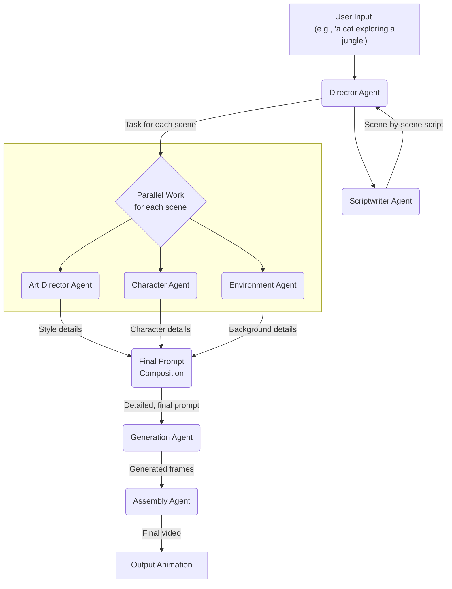
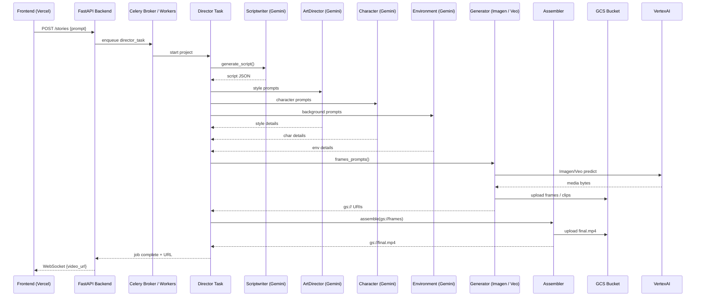

# Multi-Agent System Architecture for ToonzyAI

## 1. Overview & Vision

To elevate ToonzyAI from a simple generation tool to an intelligent creative partner, we are implementing a Multi-Agent System (MAS). The vision is to simulate a "virtual animation studio" where specialized AI agents collaborate to produce high-quality, coherent, and stylistically consistent animations.

This approach replaces a monolithic generation pipeline with a modular, flexible, and extensible framework. Each agent has a distinct role, allowing for greater specialization, easier debugging, and the ability to introduce more complex creative controls for the user in the future.

## 2. Core Concept: The Virtual Animation Studio

The core of the architecture is a team of collaborating agents, orchestrated by a "Director" agent. The process mimics the workflow of a real animation studio: from writing a script to defining characters, creating backgrounds, and finally, assembling the scenes.

**Key Benefits:**
- **Modularity:** Each agent is a self-contained unit, responsible for a specific task. This simplifies development, testing, and maintenance.
- **Quality & Cohesion:** Specialized agents ensure consistency in character appearance, art style, and narrative across the entire animation.
- **Extensibility:** The system is designed for growth. New agents (e.g., for sound design, voice synthesis, or advanced physics) can be easily integrated into the workflow.
- **Flexibility:** The process can be adapted. For example, a user could intervene at certain stages, like editing the script generated by the Scriptwriter Agent before proceeding to image generation.

## 3. Agent Roles and Responsibilities

The system is composed of the following key agents:

1.  **Director Agent:**
    -   **Role:** The project manager and central coordinator.
    -   **Tasks:**
        -   Receives the initial high-level user prompt.
        -   Orchestrates the entire workflow by invoking other agents in the correct sequence.
        -   Manages the state of the animation project.
        -   Gathers results from all agents to ensure the final product is cohesive.

2.  **Scriptwriter Agent:**
    -   **Role:** The creative storyteller.
    -   **Tasks:**
        -   Takes the user's prompt and expands it into a structured narrative.
        -   Breaks the story down into distinct scenes.
        -   For each scene, describes the actions, setting, and character emotions.

3.  **Art Director Agent:**
    -   **Role:** The guardian of visual style.
    -   **Tasks:**
        -   Establishes and maintains a consistent visual aesthetic (e.g., "anime style," "watercolor," "claymation").
        -   Injects style-specific keywords and parameters into the prompts for the Generation Agent.

4.  **Character Agent:**
    -   **Role:** The character consistency expert.
    -   **Tasks:**
        -   Manages the appearance of user-defined Avatars.
        -   Generates detailed descriptions of a character's pose, expression, and clothing for each scene based on the script.
        -   Ensures the character looks the same across different frames and scenes.

5.  **Environment Agent:**
    -   **Role:** The background and set designer.
    -   **Tasks:**
        -   Generates descriptive prompts for the background and environment of each scene.
        -   Ensures the environment matches the script's description and the overall art style.

6.  **Generation Agent:**
    -   **Role:** The image rendering engine.
    -   **Tasks:**
        -   Acts as a wrapper around the core image generation model (e.g., Stable Diffusion).
        -   Receives detailed, final prompts (combined from the Art, Character, and Environment agents).
        -   Renders the individual frames for each scene.

7.  **Assembly Agent:**
    -   **Role:** The final editor and post-production specialist.
    -   **Tasks:**
        -   Collects all generated frames from the Generation Agent.
        -   Stitches them together into a video sequence.
        -   (Future) Applies transitions, effects, and synchronizes audio.

## 4. Interaction Flow

The agents collaborate in a structured, asynchronous workflow orchestrated by the Director.



## 5. Implementation Guide

This system can be implemented using the existing FastAPI and Celery stack.

-   **Directory Structure:** We will create a new directory `backend/agents` to house the logic for each agent.
    ```
    backend/
    ├── agents/
    │   ├── __init__.py
    │   ├── base_agent.py  (Optional: A base class for agents)
    │   ├── director.py
    │   ├── scriptwriter.py
    │   ├── character.py
    │   └── ... (etc.)
    ├── tasks/
    │   └── agent_tasks.py (New Celery tasks that wrap agent logic)
    └── routers/
        └── story_routes.py (New API endpoints for the MAS)
    ```

-   **Asynchronous Execution:** The entire workflow is asynchronous and should be managed by Celery.
    -   The Director agent will initiate a chain of Celery tasks.
    -   For instance, `director.start_creation()` would trigger a `scriptwriter_task.delay()`.
    -   On completion, that task would trigger the parallel `character_task`, `environment_task`, etc., for each scene using Celery's canvas primitives (e.g., `group` or `chain`).

-   **Data Flow:** Data (like the script, scene data, and prompts) will be passed between tasks as arguments and return values. For larger data, consider storing intermediate results in the database or a temporary cache (like Redis).

-   **API Endpoint:** A new endpoint, for example `POST /stories/`, will be created to accept the user's initial high-level prompt and initiate the entire multi-agent process. 

## 6. LLM Strategy – Gemini for Text, Vertex AI for Media

To minimize cost yet keep best-in-class quality we separate language and media models:

| Use-case | Model | Endpoint |
|----------|-------|----------|
| Planning / scripts / style prompts | **Gemini (Pro / 1.5 Pro / Flash)** | Google AI Studio API-key |
| Image generation | **Imagen** (Text-to-Image) | Vertex AI (OAuth) |
| Video generation | **Veo 2 / 3** (Text- or Image-to-Video) | Vertex AI (OAuth) |

`backend/agents/llm_client.py` provides a single `LLMClient` that:
1. Checks if the app is running inside a GCP project (`GOOGLE_CLOUD_PROJECT`). If yes → uses `ChatVertexAI`.
2. Otherwise uses free AI Studio key via `google-generativeai` + `ChatGoogleGenerativeAI`.

Agents therefore remain agnostic – they just call `LLMClient().chat([...])`.

## 7. Environment Variables (.env)

```
# ==== Gemini (text) ====
GEMINI_API_KEY=AIzaSyD...          # Free API key from aistudio.google.com/apikey
GEMINI_MODEL_NAME=gemini-pro       # or gemini-1.5-pro-preview, gemini-flash

# ==== Vertex AI (media) ====
GOOGLE_CLOUD_PROJECT=my-gcp-proj
VERTEX_AI_LOCATION=us-central1
GOOGLE_APPLICATION_CREDENTIALS=/app/keys/vertex-sa.json
GCS_BUCKET=toonzy-media

# Optional runtime tuning
LLM_TEMPERATURE=0.7
```

Add them to
* local `.env`
* `docker-compose.yml → services.backend.environment`.

## 8. Extra Python Dependencies

```
# Text LLM
google-generativeai>=0.4.1
langchain-google-genai>=0.0.8

# Already present for Vertex AI
google-cloud-aiplatform>=1.47.0
langchain-google-vertexai>=0.2.0
```
Update `backend/requirements.txt` and rebuild the image: `docker compose build backend`.

## 9. End-to-End Sequence


